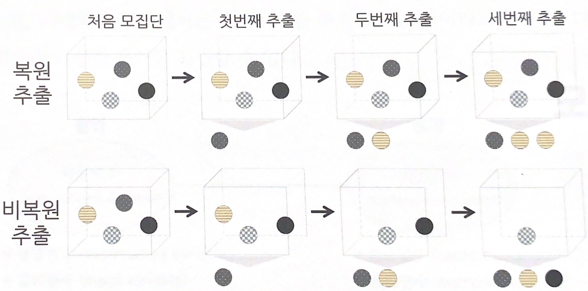
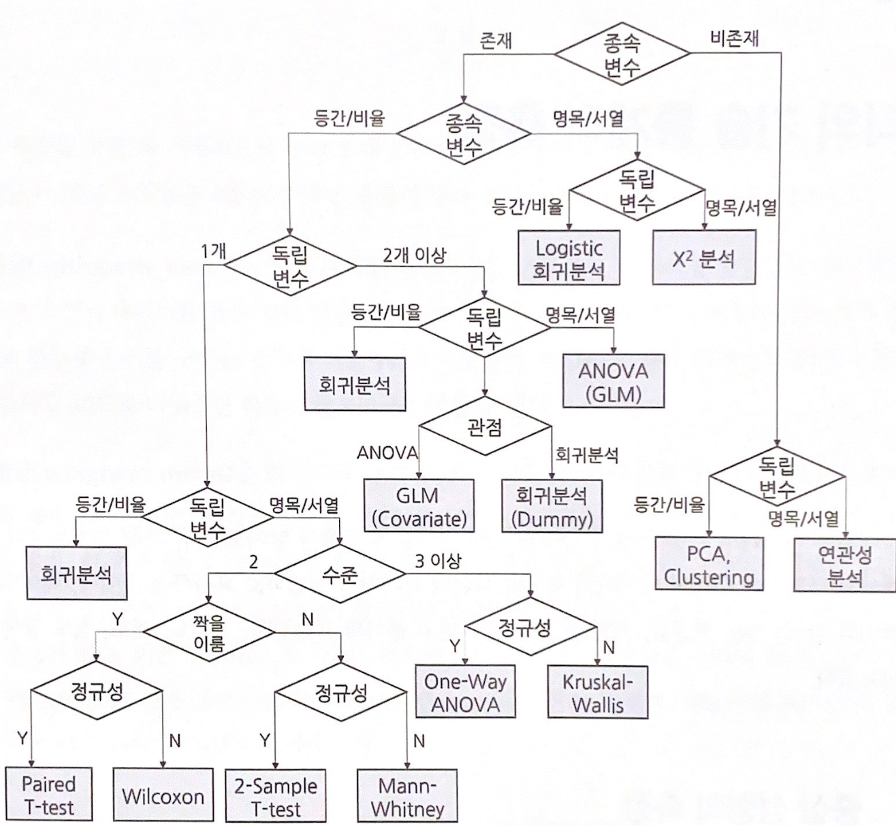

# 
<데이터 분석가가 반드시 알아야 할 모든 것>

## Study를 하기 전 해당 책을 선정한 이유는 다음과 같다.
- 처음 비즈니스 문제를 정의하는 단계부터 데이터 준비, 모델링 및 평가, 그리고 스토리텔링까지, 데이터 분석가라면 반드시 알아야 하는 모든 내용을 다룬다. 또한 불필요한 수식과 이론을 최대한 배제하고, 비전공자라도 개념을 쉽게 이해할 수 있도록 구성되어 보였고, 더불어 대상 독자로 아래 3가지를 제시하였다.
    1. 데이터 분석, 머신러닝 업무를 배우고자 하는 초심자 및 학생
    2. 퍼이썬 프로그래밍 언어와 관련된 기본적인 내용을 알고 있는 사람        
    3. 업무 중 지속적으로 참고할 만한 책을 원하는 현업 데이터 분석가
    
1번과 2번 특히 1번 데이터 분석가로 직무 전환을 위해 공부하고 있어서 이 책을 선정한 이유이다.

## 1. 모집단과 표본추출
### 1.1. 모집단과 표본, 전수조사와 표본조사
통계분석을 하려면 분석하고자 하는 대상의 데이터가 있어야한다. 
분석 대상 전체 집합이 **모집단**이고, 모집단의 부분집합 = 일부 추출한 것은 **샘플**이다.
일반적인 상황에서 모집단의 데이터를 모두 구해 통계분석 및 머신러닝 하는것은 무리 -> 방대한 데이터 컴퓨터 파워 부담을 주고, 전체 데이터 수집이 어렵다.
모집단의 자료 전체를 조사 및 분석해서 정보를 추출하는 것을 **전수조사**
추출한 표본을 통해 모집단 정보(평균, 표준편차 등)를 추정, 검정하는 것을 **표본조사**
* 전수조사 대표적인 것 -> 선거 투표
* 투표를 하기전 여론조사하는것을 표본조사라고 보면 된다. <- 모집단의 결과 유추

전체 전수조사를 하면 막대한 비용과 시간이 들어간다. 그래서 사전에 표본조사 진행하는 것 그렇기 때문에 적은 표본으로 최대한 높은 정확도 이끌어내는것이 중요하다!
효과적인 표본조사를 하려면 표본추출이 중요해짐. 표본추출 에는 다양한 방법이 존재함. 그중 데이터의 형태, 분포에 따라 올바른 방법을 선택해야함.
### 1.2. 표본조사를 하는 이유와 데이터과학 적용 방법
표본추출은 언제 어떻게 해야하는걸까?
데이터 과학을 위한 분석 모델링 단계에서는 수많은 테스트와 검증을 한다.
또 머신러닝 모델에 사용하기 위한 데이터를 가공하는 단계에서도 원하는 데이터 구조가 완성 될 때까지 여러 번 시행착오 거친다. 이 모든 단계를 대량의 데이터로 수행시 많은 비용과 시간이 소모
따라서 최종 분석에는 전체 데이터를 사용해도, 분석 모델이 완성 전까지는 표본 데이터를 활용하는 것이 경제, 시간적으로 유리하다.
데이터는 어느 정도 이상 확보 시 모수와 표본 통계량의 차이가 거의 없어졌고, 일반적으로 최소 200개 이상 표본 확보 시 분석 가능하다.
변수의 개수나 표본분산에 따라 더 많은 표본이 필요할 수 있고, 통계적으로 변수 하나당 최소 30개 관측치가 필요로 한다.
예를 들어 20개의 변수를 사용하는 예측 모델을 만든다 -> 최소 600개의 표본 관측치를 가지고 테스트 진행 해야함.
- 관측치 = 아래 첨자 알파벳 / 변수와 같은 알파벳으로 표현하고 아래 첨자로 몇번 째 관측인지 표현. 

데이터 가공 및 변환이 수도 없이 일어나는 것을 예측, 분류 모델링 단계에서는 적절한 표본을 추출해서 진행한다.
전체 프로세스가 완성됐을 때 전체의 데이터 사용 최종 모델 성능을 확인 예측 및 분류를 하는 것이 좋다.
모집단이 무한히 많은 경우 외 모집단에 대한 정확한 파악이 불가능하거나 자동차 충격 테스트와 같은 파괴적인 조사시 표본조사를 실시 해야한다. 한정된 표본으로 최대한 모집단과 일치하는 통계치를 산출하는것이 좋다.
- 표본 조사를 통해 모집단의 크기를 유추하는 방법.
일반적인 여론조사나 시장조사는 그 대상이 명확해 모집단이 어느 정도 되는지 쉽게 알 수 있다.
    ex) - 서울 시장 후보 여론조사의 모집단은 투표권을 가진 서울시민 수
        - 20~30대 여성을 타깃으로 하는 의류 업체의 소비자 모집단은 대한민국 20~30대 여성 수 이다. 
만약 서울시 관악구에 사는 길고양이가 총 몇 마리인지 알아내려면?
관악구 모든 고양이를 포획하면 된다. 비용과 시간은..??
이럴 때 사용하는 표본조사 방법이 **표지 재포획법**이다. 
먼저 100마리 고양이에게 표식을 한다. 그리고 다음날 100마리를 또 포획한다. 그러면 그중 표식이 있는 고양이가 있을것이고, 비율을 통해 관악구 길 고양이 모집단 수를 추정할 수 있다. 
수식으로는 **${100 \over N} = {n \over 100}$** 왼쪽 분수는 전체 모집단 N 중에서 처음 포획해서 표식을 남겼던 100마리 길고양이 뜻하고, 오른쪽 분수는 두 번째로 포획했던 100마리 길고양이 중 표식이 남아있는 n 마리의 길고양이를 뜻한다.
만약 두 번째 포획했을 때 표식이 남아있는 고양이가 10마리면 관악구 길고양이는 1000마리라 추정할 수 있음. 전체 중에 100마리는 100마리 중에 10마리${1 \over 10}$이므로, 100마리에 10을 곱해주는 것 <- 이러한 방식은 서식지에 사는 생물들의 군집의 밀도 파악, 유동 인구 추정할 때 사용된다. 
### 1.3. 표본추출에서 나타나는 편향의 종류
모집단과 표본은 자연적으로 차이가 존재한다.
1000개의 관측치가 있는 모집단에서 999개를 추출한 표본이라 해도 그 평균과 분산은 약간의 차이가 날 것.
이러한 모집단과 표본의 자연 발생적인 변동을 **표본 오차**라고 함. 즉 같은 크기의 두 개의 표본을 주의해서 추출해도 완전히 동일한 표본을 얻는 것은 거의 불가능
표본오차는 추론통계의 개념을 이해하는 데 중요한 개념. 이를 제외한 변동을 **비표본 오차**라고 함. 비표본 오차의 한 원인이 바로 **편향**이다.
편향은 표본에서 나타나는 모집단과의 체계적인 차이 표본 추출 과정에서 대표적으로 다음과 같은 편향이 발생할 수 있음.
- **표본추출 편향** : 추출 과정에서 체계적인 경향이 개입. 모집단에서 편향된 표본만 추출되는 경우 
    - ex) 루스벨트가 대통령 선거에 출마할 당시 전화번호부를 통해 파악한 주소를 이용 여론조사 실시. 그 당시에는 전화 보급이 완전히 대중화 되기 전 그래서 여론조사의 표본은 전화기가 있는 부유한 가정 위주로 이뤄졌고, 가난한 사람에게 인기 있는 루스벨트에게 불리한 예측이 나옴.

- **가구편향** : 모집단의 부분 집단 단위에서 하나의 관측치씩 추출하는 경우, 크고 적은 집단이 작고 많은 집단보다 적게 추출되는 경우.
    - ex) 각 가구의 집 전화를 통해서 여론조사 실시할 경우, 가족구성원이 많은 가정의 사람이 가족구성원이 적은 가정의 사람보다 추출될 확률이 줄어 전체적인 표본의 균형이 맞지 않는 결과가 생겨남.

- **무응답편향** : 설문에 응답하지 않는 사람들과 응답하는 사람들에 체계적 차이가 있는 경우.  
    - ex) 지지 정당 설문의 경우 시간적 여유가 있어 설문에 쉽게 응하는 사람과 바빠서 응답을 하지 않는 사람들 간에 지지하는 정당이 차이가 있다면 표본에 편향이 발생

- **응답편향** : 설문 형식의 문제, 응답자의 심리적 이슈에 의해 표본이 영향을 받는 경우. 
    - ex) 선거당일 치러지는 출구조사에서, 설문자가 사회적 시선이나 여론의 분위기 때문에 조사원들의 답변에 거짓을 말해 편향이 발생(브래들리 효과) 
    * 브래들리 효과 = 여론조사를 할 때 피조사자가 자신의 생각이나 신념을 밝히기 어려워 거짓된 응답을 하는 현상.

이러한 표본 편향은 확률화 등의 방법을 통해 최소화 또는 제거할 수 있음. 
확률화란 모집단으로부터 편향이 발생하지 않는 표본을 추출하는 방법을 의미이다. 이렇게 추출한 표본을 **확률표본**이라 한다. 
모집단에서 표본이 추출될 확률이 동등한지 여부에 따라 **확률추출과 비확률추출**로 구분. 모집단에서 이미 추출한 표본을 다시 모집단에 **되돌려 놓고 추출하는지, 빼고 추출하는지에 따라 복원추출과 비복원 추출**로 구분한다.
### 1.4. 인지적 편향의 종류
데이터 과학 및 데이터 분석은 숫자를 면밀히 살펴보고 결론을 도출해 내는 작업이다.
매우 객관적이고 정확한 것 같지만 앞에서 분석가가 표본을 어떻게 선택했는가에 따라서 결과가 정반대로 나왔던 것처럼, 주관적인 판단이나 고정관념이 결과에 많은 영향을 미친다. 
분석가의 성향이나 상황에 따라 비 논리적인 추론을 내리는 패턴인 인지적 편향에 대해 알아보자
**인지적 편향** = 인지심리학, 사회심리학 분야에서 제시한 개념. 대표적으로 다음과 같은 5가지 인지적 편향이 있다.
1. **확증편향** : 자신이 본래 믿고 있는 대로 정보를 선택적으로 받아들이고 임의로 판단하는 편향. 주어진 정보를 자신의 입맛대로 필터링하려는 성향 이는 의사결정 단계는 물론 정보 수집 단계에서도 나타남. 
데이터의 통계량은 조건에 따라 다양하게 나옴. 자신의 판단에 대한 확신을 더해주는 방향으로만 데이터를 조정하기도 함. 이를 분석가들은 데이터를 마사지한다라고 표현한다. 
확증편향에 의해 처음부터 생각해 두었던 가설에 유리한 방향으로 정보를 수집, 해석하는 것 명백한 오류이다. 분석의 신뢰성 떨어짐 이를 방지하기 위해 두명이 크로스 체크를 하거나, 블라인드 분석을 수행해야한다.
2. **기준점 편향** : 분석가가 가장 처음에 접하는 정보에 지나치게 매몰되는 편향 처음 표본을 통해 나왔던 통계가 머릿속에 각인, 다른 분석 결과를 무시 또는 과소평가하는 것이다. 일상에서도 이러한 기준점 편향이 적용된다. 
    - ex) 연봉 협상할 때, 처음 제안받는 금액이 협상의 기준점으로 자리 잡아, 그 범위 내에서 연봉을 협상하게 된다. 이는 생각의 틀을 만들어내어, 합리적 결정 방해
3. **선택 지원 편향** : 확증편향과 유사한 개념 본인이 의사결정을 내리는 순간 그 선택의 긍정적인 부분에 대해 더 많이 생각하고 그 결정에 반대되는 증거를 무시하게 되는 편향. 확증편향은 기존의 상식과 고정관념으로 정보와 근거들을 선택적으로 수영한다. 하지만 선택 지원 편향은 주어진 정보들을 통해 의사결정이 이루어진 순간부터 편향성을 가진다는게 차이점.
4. **분모편향** : 분수 전체가 아닌 분자에만 집중하여 현황을 왜곡하여 판단하게 되는 편향. 
    - ex)역사적으로 사장자가 가장 많았던 전쟁 = 제2차 세계대전 하지만 전체 인구를 분모로 고려하면, 8세기 중국에서 발생한 안록산의 난 사망자로 가장 많은 사상자가 발생. 이처럼 분모를 무시하면 잘못된 판단을 내릴수가 있음. 주의점 비율도 분모 편향의 영향을 받을수 있음. 
    - ex) 1990년대 국내 은행 평균 예금 금리는 10% 안팎, 2010년대 금리는 2.5%가량 됐다. 이 수치만 보면 1990년대가 훨씬 좋은 시대로 보이나, 금리와 필수 관계인 물가 상승률을 분모로 적용하면, 1990년대 물가상승률은 6% 2000년대 물가상승률은 0.5% 불과 즉 물가상승률 고려했을 때 1990년대 금리가 결코 2000년대보다 훌륭하다고 할 수 없음.
5. **생존자 편향** : 소수의 성공한 사례를 일반화된 것으로 인식함으로써 나타나는 편향. 
    - 제 2차 세계대전 당시 전투기는 전략상 매우 중요하고, 비쌌음. 격추되면 손실이 커 엔지니어들은 전장에서 돌아온 전투기들의 총탄 자국들을 분석해 취약한 부분 보강. 
    총알 자국이 많았던 날개, 꼬리 부분 보강하려 했지만 총괄 연구원이 조종석과 엔진 부를 집중 보완해야한다고 주장했다. 전체 부위에 피격확률은 비슷해도 조종석과 엔진 부의 총탄 자국이 적은 이유는 그 부분이 치명적이기 때문에 전투기들이 귀환하지 못했기 때문이라는 것.
    그의 통찰이 없었다면 엔지니어들은 헛수고만 했을것이다. 이처럼 이미 선택 과정을 통해 필터링된 일부의 정보만으로 잘못된 판단을 내리는것을 생존자 편향이라 함.
### 1.5. 머신러닝 모델 측면의 편향과 분산
편향이 머신러닝 모델에서 어떻게 나타나는지를 아는 것도 상당히 중요. 편향을 제대로 이해하기 위해서 분산도 함께 이해해야 한다.
**편향**은 예측값들이 정답과 일정하게 차이가 나는 정도를 의미한다. **분산**은 주어진 데이터 포인트에 대한 모델 에측의 가변성을 뜻한다.
- ex) 모델 2개를 학습 정답 값을 대략적으로 예측하는 A 모델과 정확히 예측하는 B 모델이 있다. A모델은 예측값을 나타내는 선이 단순하다. 그렇기 때문에 정답과 예측값과의 차이가 클수밖에 없고, 이를 **편향**이 크다고 한다. 또 일반화가 잘되어 있어 예측값이 일정한 패턴을 나타내는데 예측값의 변동성이 적다. 이를 분산이 적다고 말한다.
이제 모델 B를 보면 예측값이 정답과 완벽히 일치한다. 따라서 모델 B는 편향이 매우 작다고 할 수 있다. 하지만 예측값이 매우 들쑥날쑥하게 위치해 있어서 만약 다른 정답 값이 주어지면 예측값과의 차이가 A 보다 오히려 더 커질 수도 있다. 이를 분산이 크다라고 말한다. 
편향과 분산은 트레이드오프 관계다. 예측이나 분류 모델을 만들 때 주어진 학습 데이터에 잘 맞도록 모델을 만들수록 편향은 줄고, 분산은 증가한다. 
이러한 둘 간의 균형을 잘 맞춰 상황에 맞는 최적의 모델을 만드는 것이 데이터 과학자의 역할이다.

</img>

위 그림에서 볼 수 있듯이 모델의 복잡도가 상승할수록 편향은 감소하지만 분산은 증가한다. 
실제 실무 상황에서는 전체 에러, 즉 정확도뿐만 아니라 비용과 정확도의 가치 등을 종합적으로 고려하여 최적의 모델 복잡도를 선택해야 한다.
편향과 분산을 개념적으로 잘 설명하는 대표적인 예시를 확인해 보자.
영점사격을 보면 표적에 총을 쐈을 때 타깃과 좀 떨어져도 모든 구멍이 일정하게 모여 있으면 탄착군이 잘 형성됐다고 하는데 이를 분산이 작은 것, 타깃 주변으로 구멍이 몰린 상황을 편향이 적은 것이라 할 수 있다.

</img>

왼쪽 상단의 표적은 이상적으로 정중앙에 점이 몰려 있다. 이는 편향과 분산이 모두 작은 상태, 반면 오른쪽 상단은 편향은 작지만 분산이 크기 때문에 정가운데 약간 벗어난 점들이 있음. 일반적인 머신러닝 모델은 이러한 형태를 갖는다. 이렇게 분산이 큰 이유는 모델의 복잡성이 너무 커서 과적합이 일어났기 때문이다.
오른쪽 하단은 편향과 분산이 모두 큰 상태로 모델로서 효과가 없는 상태다. 마지막 왼쪽 하단의 표적은 분산은 적지만 편향이 큼, 이러한 경우 정답 값을 제대로 설명할 수 있는 변수가 부족한 상태라 표본 추출 방법을 바꾸거나 새로운 변수를 탐색해 고도화된 데이터 가공 방식을 적용해야 한다.

### 1.6. 표본 편향을 최소화하기 위한 표본 추출 방법
표본오류와 비표본 오류를 최대한 줄이면서 표본추출을 할 수 있는 방법. 
실제 데이터분석 업무에서 표본추출은 상당히 자주 수행하는 작업이다. 개념을 확실히 알아두자!
우선 표본추출은 상당히 자주 하는 작업이라 개념을 확실히 알아 두는 것이 좋다.

**표폰추출**을 두 가지 관점에서 바라볼 필요가 있다. 
- 첫째는 데이터 수집 단계의 표본 추출. 지방선거 여론조사를 위한 대상자 선정, 기업이 시장조사를 하기 위해 설문조사 표본을 구하는 것과 같은 상황에서의 표본 추출
- 둘째는 기업에서 이미 가지고 있는 몇 천만 건의 고객 정보데이터, 인터넷 기업의 웹 로그 데이터 등과 같은 이른바 빅데이터에서 분석 모델링을 위한 적절한 크기의 표본데이터를 추출하는 것.

일반적인 통계 서적에서는 첫 번째와 같은 상황에서의 표본추출 과정을 주로 다룬다. 
하지만 기업의 데이터 분석 실무에서는 두 번째 상황의 표본추출을 하게 되는 경우가 더 많다. 데이터 수집 단계의 표본 추출은 일반적으로 다음과 같은 단계로 구성된다.
 						
- **모집단 확정**
조사대상이 되는 사람, 사물, 조직, 지역 등의 전체 집합을 구체적으로 정의

- **표본 프레임 결정**
모집단에 포함되는 조사 대상의 목록 설정
    - ex) A회사 직원을 모집단으로 확정한 경우, 현 시점의 인사 시스템에 등록된 임직원의 목록

- **표본 추출방법 결정**
확률표본추출과 비확률표본추출, 복원과 비복원 추출 중 적절한 방법 선택

- **표본크기 결정**
조사의 유형, 시간, 예산 등을 고려하여 추출할 표본의 크기를 결정

- __표본추출__
선정된 조사 대상들을 추출

이미 보유하고 있는 대용량의 데이터에서 표본을 추출하는 순서도 이와 크게 다르지 않고, 모집단과 표본프레임이 이미 결정되어 있어, 표본을 추출할 방법과 크기를 결정하면 된다.
그전에 모집단이 분석 목적에 맞게 세팅이 됐는지 확인이 필요하다. 모집단의 데이터셋이 올바르게 구성 안되어 있으면 표본추출은 의미가 없음.
데이터에 이상이 없는 모집단과 표본프레임이 확정되면 확률, 비확률 표본추출 방법 그리고 복원, 비복원 추출 중 적절한 방법을 선택해야한다. 

거의 대부분 확률 표본추출방법을 사용한다. 모든 분석 대상이 무작위로 추출될 확률을 미리 알 수 있을때 사용 그렇기 때문에 표본의 통계량을 통한 모집단의 모수에 대한 추론이 가능하다.
편향을 최대한 제거할 수 있어 표본의 신뢰도가 높다. 데이터 수집단계의 표본추출의 경우 때로 표본프레임 설정이 어렵기 때문에 확률 표본추출방법을 사용할 수 없을 수도 있지만, 보유데이터에서 표본을 추출할 경우 확률 표본추출방법을 사용한다.
확률 표본추출방법은 대표적으로 단순 무작위 추출, 계층적 표본추출, 층화 표본추출, 군집 표본추출방법 등이 있다.

- **단순 임의 추출방법** = 제비 뽑기나 로또 당첨번호를 선정하듯 표본을 추출하는 방법. 때문에 모집단의 모든 구성단위가 표본으로 선정될 확률이 동일하다.
모집단에 대한 사전지식이 없는 경우에 유용한 방법이고, 다른 표본추출방법에 비해 쉽고 빠르기 때문에 가장 일반적으로 쓰임.
- **계층적 표본추출방법** = 모든 구성단위에 일련번호를 부여하고, 일정한 간격으로 표본을 선택하는 방법이다. 
    - ex) 1000개의 모집단에서 100개의 표본을 추출하는 경우 1번부터 1000번 중 10번, 20번, 30번.. 을 추출하는 것. 이 방법은 모집단 전체에 걸쳐 등간격으로 공평하게 표본이 추출되는 장점이 있지만 모집단의 배열에 일정한 주기성이 있는 경우 표본의 대표성이 결여될 수 있다.
- **층화 표본추출방법** = 모집단이 특정한 기준으로 분류가 가능할 때 쓰일 수 있는 방법.    
    - ex) A 기업의 고객을 구매등급별로 나누어서 각 등급에서 일정수의 표본을 무작위로 추출하는 것. 이렇게 모집단을 특정 기준에 따라 소집단으로 나누려면 모집단에 대한 사전지식과 분류 기준에 대한 충분한 근거가 필요하다.
    이 방법은 표본을 단순 임의 추출방법으로 선정했을 때 표본이 편중될 수 있는 위험을 보완한다.
- **군집 표본추출방법** = 층화 표본추출처럼 모집단을 특정한 기준으로 분류한다. 
그중 하나의 소집단을 선택하여 분석하는 방법 하나의 소집단이 선택되면 상황에 따라 소집단 전체나 일부를 표본추출. 
이 방법은 모집단이 방대한 상황에서 표본추출이 쉽지 않을 때 유용하나 특정 기준으로 분류된 하나의 소집단만을 표본으로 두기 때문에 전체 모집단의 모수를 반영하지 못할 수도 있다는 단점이 있다.

</img>

복원과 비복원 추출은 말 그대로 추출했던 표본을 원래 모수에 복원시켜서 다시 추출이 가능하도록 하는가 그렇지 않은가에 따라 구분되는 방식이다.

</img>

- **복원추출법** = 처음 모집단에서 추출된 표본을 되돌려 넣고 다음 표본을 추출하는 방법. 그렇기 때문에 동일한 표본이 중복해서 선택될 수 있다. 
이 방식은 표본을 뽑은 후 모집단을 다시 복원시키기 때문에 표본공간은 독립적으로 변화가 없다.모집단에서 A라는 표본을 한 번 뽑았다고 해서 다시 A 표본이 추출될 확률이 줄어들거나 하지 않는다.
- **비복원추출법** = 처음 모집단에서 추출된 표본을 되돌려 넣지 않고, 다음 표본을 추출하는 방법이다. 따라서 표본을 하나 추출하는 행위는 표본공간을 바꾸는 종속사건이 된다. 
표본을 추출하면 다음 표본들의 추출 확률에 영향을 미치는 것이다.

일반적으로 모집단에 비해 추출하려는 표본의 양이 작으면 복원, 비복원 추출은 차이가 거의 없다. 하지만 모집단의 크기가 별로 크지 않거나 추출하는 표본이 20%이상 많은 경우 복원 추출방식이 편향을 줄일 수 있다. 
만약 1부터 10까지 총 10개의 관측치가 들어있는 모집단에서 4개를 복원추출을 할 경우, 가능한 순서표본의 개수는 10X10X10X10 = $10^4$이 된다. 반면, 비복원 추출을 하면 10X9X8X7 = $_{10}\mathrm{P}_{4}$ = 5040이 된다.

## 2. 변수와 척도
독립변수, 종속변수 등의 개념을 익히고 변수 간의 인과관계, 상관관계, 의사관계 등에 대해서 알아보고, 변수의 데이터적 속성이라 할 수 있는 척도의 종류를 알아보자.
변수의 적도는 크게 질적 척도와 양적 척도로 나뉘며, 질적 척도는 명목척도와 서열척도로 구분되고 양적 척도는 등간척도와 비율척도로 구분된다.
### 2.1. 변수의 종류
데이터과학, 분석은 변수와 변수의 관계를 밝혀내는 활동이다. 따라서 변수들의 개념과 관계를 명확하게 숙지하고 있는 것이 무엇보다 중요하다. 
우선 변수는 그 값들을 가감승계로 연산을 하는것이 의미가 있는지, 없는지에 따라 양적변수와 질적변수로 구분한다.
- **양적변수**는 사람 수나 휴대폰 판매량과 같이 정숫값만 취할 수 있는 이산변수와 길이나 무게처럼 연속적인 모든 실숫값을 취할 수 있는 연속변수로 나눌 수 있다.
- **질적변수**는 성별, 종교, 직업 등과 같은 비계량적 변수로서 속성을 숫자로 변환하더라도 수치적 의미는 가지고 있지 않다.
    - ex) 남성을 1, 여성을 2로 변환했을 때, 여성(2) - 남성(1) = 1이 될 수 없는 것이다.

변수의 관계적 측면으로 보면, 독립변수와 종속변수가 관계의 핵심! 이 둘은 원인과 결과의 관계
- ex) 흡연과 폐암의 관계라 하면, 흡연은 원인인 독립변수, 폐암은 결과인 종속변수다. 

독립변수와 종속변수는 학문 분야나 상황에 따라 다양하게 불린다. 특히 패턴인식, 기계학습 분야에서는 독립변수를 **특징(feature)**이라고 부른다.
다음 그림을 통해 독립변수와 종속변수의 다양한 용어를 확인할 수 있다.

</img>

독립변수와 종속변수는 기본적으로 서로 상관관계를 갖고 있다.
- ex) 독립변수는 혈중알코올농도이고 종속변수는 운전 중 사고 발생률이라 가정해 보면 혈중알코올농도가 증가할수록 사고 발생률도 증가할 것이다. 이처럼 두 변수의 수치가 상관성을 갖는 것을 상관관계라 한다.

유의할 점은 독립변수 간에도 상관관계를 가질 수 있다는 점이다. 앞의 혈중알코올농도 예시에서 전날 수면시간 이라는 독립변수가 추가 됐다고 해보면 혈중알코올농도와 전날 수면시간은 약간의 상관관계를 가질 수 있다. 
전날에 술자리를 오래 해서 수면이 부족할 수 있기 때문에 반면 연령이라는 독립변수는 혈중알코올농도와 상관관계가 거의 없을 수도 있다. 

독립변수 간에는 상관관계가 없어야 한다. 물론 그런 경우는 거의 없기 때문에 독립변수 간에 상관관계를 최소화해 줄 필요가 있다. 
독립변수 간의 상관관계가 높으면 독립변수들과 종속변수와의 연관성을 측정하기 어렵기 때문이다.그리고 독립변수와 종속변수는 단순한 상관관계가 아닌 원인과 결과의 관계를 가지고 있어야 한다.
혈중알코올농도가 원인이고 사고 발생률이 결과인 관계는 성립하지만,사고발생률이 원인이고 혈중알코올농도가 결과인 관계는 어색하다. 
이처럼 어떠한 현상을 종속변수로서 설명하기 위해 원인이 될 수 있는 요소를 찾아내고 올바른 독립변수의 관게로 설정해야 한다.

변수 간의 관계가 항상 단순한 원인과 결과의 관계만 있지는 않을 것이다. 독립변수와 종속변수 외에도 통제변수, 매개변수, 조절변수 등이 있다.
통제변수는 실험이나 설문조사를 할 때 종속변수에 영향을 줄수 있는 외부 요소를 통제하기 위해 사용되는 변수다. 
- ex) 혈중알코올농도와 사고 발생률을 밝히는 모델에서 수집된 데이터가 어떤 경우는 밤에 측정되고 어떤 경우는 낮에 측정되거나 또는 맑은 날씨에 측정되고, 어떤 경우는 폭우가 쏟아지는 날씨에 측정된다면 독립변수가 종속변수에 주는 영향력에 편향이 생길 것이다.
따라서 데이터 측정 시에는 시간, 날씨, 온도 등을 일정하거나 무작위적으로 배분되도록 통제해 줄 필요가 있다. 이것이 통제변수다.
### 2.2. 변수 관계의 종류
변수 간의 다양한 관계를 이용하면 복잡한 통계적 관계성도 분석이 가능하다. 또한 변수의 관계를 잘 이해해 놓으면 논리적 오류, 인과관계의 오류를 어느 정도 예방할 수 있다.
우리 주변의 데이터들은 매우 복잡하게 얽혀 있다. 때문에 미묘한 변수 간 관계의 차이를 잘 구분하지 못하면 힘들게 분석 프로젝트를 수행하고서 엉뚱한 결과를 내놓는 실수를 초래할 수 있다.

대표적으로 많이 쓰이는 몇 가지의 변수 관계들을 살펴본다.
- **인과관계** = 독립변수와 종속변수의 기본적 관계. 변수가 다른 변수의 원인이 되는 영향을 미친다. 인간의 과학 역사 자체가 원인과 결과의 관계를 규명하는 활동의 역사라 할 수 있을정도 인과관계는 세상을 바라보는 기본적인 관점 
- **상관관계** = 변수 간에 관련성이 존재하는 관계. 이는 인과관계의 상위개념으로 볼 수 있다. 변수 간에 양 혹은 음의 관련을 갖고 있으나, 꼭 한 변수가 다른 변수의 원인인 것은 아니다.
단순히 변수 간에 상관성이 있으면 그 변수들은 상관관계인 것 따라서 인과관계는 상관관계이기도 하다. 독립변수 간에도 상관관계가 있을 수 있으며, 이는 다중공선성 이라는 문제를 불러 일으킬 수 있다.
    * 다중공선성 : 독립변수들 간의 상관관계가 존재하여 독립 변수의 변화에 따른 종속 변수의 변화량을 크게 하여 통계적 정확도가 감소되는 현상.
- **상관분석 내용** = 두 변수가 완전한 독립관계일 때 상관계수는 반드시 0이다.
하지만 상관계수가 0이어도 두 변수는 독립관계가 아닐 수도 있다. 바꿔 말해 두 변수가 독립관계가 아니어도 상관계수는 0이 될 수 있다. 이는 상관계수를 구하는 수식에서 발생하는 하나의 허점이다.
- **독립관계** = 변수 간에 상관성, 즉 상관계수가 0인 관계이다. 독립변수의 이름이 독립인 것도, 독립변수들 간에는 상관성이 없는 독립관계이기 떄문이다. 데이터 분석에 있어서 독립변수 간은 서로 독립관계여야 한다.
- **의사관계** = 변수간에 상관성은 있지만, 그 상관성이 다른 변수에 의해 나타난 관계이다.
    - ex) 아이스크림 판매량과 익사사고 발생 수에 높은 상관관계가 나왔다고 하자, 사람들이 아이스크림을 많이 먹으면 물에 빠져 죽게 되는 것일까? 원인은 기온이라는 제 3의 변수와의 관계 때문이다.
    기온이 오르면 아이스크림 판매량이 증가, 물놀이를 가는 사람이 많아지면서 자연스럽게 익사 사고도 증가하게 된 것이다. 데이터 분석 사례에서 이런 경우가 생각보다 자주 발생한다. 이런 오류를 방지하기 위해서는 단순한 통계 수치에만 연연하지 않고 변수에 대한 깊은 이해와 함께 논리적 개연성을 항상 생각하며 분석을 해야 한다.
- **양방향적 인과관계** = 두 변수가 서로 간에 인과적 영향을 미치는 관계.
    - ex) A 기업의 투자금과 매출액의 관계를 보면, 초기투자 -> 매출액 증가 -> 후기투자 -> 매출액 증가와 같은 양방향적 인과관계를 나타낼 수 있다.

</img>

- **조절관계** = 독립변수와 종속변수 사이에서 강하고 불확정적인 영향을 미치는 관계.
    - ex) 직원들의 업무만족도에 따른 기업 매출(종속변수)의 변화를 알아보는 모델이 있다고 생각해 보자. 이러한 업무만족도(독립변수) -> 기업 매출(종속변수) 간의 관계에서 성별이라는 조절변수가 추가되는 것이다.
    이로써 남성이면서 업무만족도가 변화할 때 기업매출의 증감과 여성이면서의 업무만족도와 기업매출 변화 관계를 분석할 수 있다. 이렇게 성별이 업무만족도와 기업매출의 조절관계가 되는 것이다.

- **매개관계** = 독립변수와 종속변수의 중간에 매개변수가 개입되어 독립변수의 영향을 종속변수에 전달하는 관계. 매개관계에서는 시간적 차원이 포함돼 있다. 
매개변수가 독립변수와 종속변수의 중간다리의 역할을 하는 것. 매개관계는 조절관계와 달리 독립변수, 종속 변수와 직접 영향을 주고받는다. 처음에는 조절관계와 매개관계의 구분이 다소 어려울 수 있다.
조절관계는 독립변수와 종속변수 간 관계의 강도를 조절하는 역할, 매개관계는 독립변수의 영향을 종속변수로 전달하는 역할

*구조방정식 모델과 변수
회귀분석, 요인분석 등에 사용되는 구조방정식 모델에서는 조금 다른 변수 개념을 사용한다. 간단하게 구조방정식 모델은 측정모형과 이론모형을 통해서 모형 간의 인과관계를 파악하는 방정식 모형 이라고 정의할 수 있다. 일반적으로 알고 있는 독립변수와 종속변수의 관계를 보다 복잡하게 구현하는 데 효과적인 분석방법
독립변수와 종속변수가 다수 존재하여 종속변수 간의 관계까지 파악해야 하는 모델의 경우에는 단순한 회귀분석 모델은 각각의 모든 변수들 간의 유의치를 보지 못한다. 하지만 구조방정식은 독립-종속 변수 간은 물론 종속-종속 변수 간의 모든 유의치를 볼 수 있다. 이에 따라 구조방정식의 변수 개념도 약간은 고차원적이다.
독립변수와 종속변수의 개념은 관측변수와 잠재변수로 표현되고, 외생변수와 내생변수의 개념으로도 확장이 가능하다.

</img>

관측변수(독립변수)들이 모여서 하나의 잠재변수(종속변수)를 설명하게 되고 그 잠재변수가 다른 잠재변수와 관계를 갖게 되면서, 독립변수의 역할을 하는 외생변수가 되기도 하고 종속변수의 역할을 하는 내생변수가 되기도 한다.
이러한 관계는 외생 잠재변수, 내생 잠재변수, 외생관측변수, 내생관측변수로 표현되기도 한다.

### 2.3. 척도의 종류
원할한 데이터 분석을 하기 위해서는 데이터를 통계적 분석이 가능하도록 객관적 척도로 변환하는 작업이 우선되어야 한다. 
척도는 측정하고자 하는 대상을 수치화하는 것에 사용되는 일종의 측정 도구다.
척도는 변수의 성질에 따라 총 4가지로 분류된다. 우선 변수가 질적/양적인가에 따라 질적척도(범주형 척도)와 양적척도(연속형 척도) 분류된다.
질적척도는 속성값을 범주로 나타내는지 순위로 나타내는지에 따라 명목척도와 서열척도로 분류된다. 
양적척도는 절대적 기준인 영점이 존재하는가에 따라 등간척도와 비율척도로 나뉜다. 명목 - 서열 - 등간 - 비율 척도는 뒤로 갈수록 포함하고 있는 정보의 양이 점점 많아진다.

</img>

- **명목척도** = 조사대상의 속성이나 범주를 구분하기 위한 목적으로 만들어진 척도 다른 척도들보다 정보량이 가장 적다. 
순서, 거리 및 원점의 개념이 없기 때문에 숫자로 변환한다 해도 순서나 크기에 의미가 없다. 구분을 위한 단순한 기호에 불과하기 때문에 변수 간의 사칙연산은 의미가 없는 것.
대표적인 예로 운동선수의 등번호 숫자의 차이로 크고 작음을 측정할 수가 없고 숫자로 변환한 혈액형 정보를 더하고 빼는 것은 의미가 없다.
- **서열척도** = 조사대상의 속성 크기를 측정하여 대상 간의 순서관계를 측정하는 척도이다. 서열척도는 명목척도와 같이 대상을 서로 구분할 수 있는 정보도 포함하고 있다. 
성적 1,2,3등 처럼 서열을 통해 조사대상을 구분할 수 있다. 아울러 조사대상 간의 순서와 우위에 대한 정보를 함께 포함하고 있다. 하지만 순서 사이의 간격에 대한 정보는 가지고 있지 않다.
    - ex) 한 학급의 성적 1등과 2등은 순서에 대한 정보는 가지고 있지만, 1등과 2등의 구체적인 점수 차이에 대한 정보는 가지고 있지 않다.
- **등간척도** = 서열척도가 가지고 있는 정보와 함께 조사대상이 가지고 있는 속성의 상대적 크기의 차이를 비교할 수 있는 정보도 가지고 있다.
섭씨온도의 경우 1도,2도,3도가 같은 간격으로 나누어져 있으므로 속성 간의 상대적 차이를 가감(+,-)하는 것이 가능하다.
30도는 20도보다 10도가 높다고 할 수 있다. 하지만 절대 0점은 정의할 수 없기 때문에 곱하기나 나누기를 할 수는 없다. 쉽게 말해 영상 20도가 영상 10도의 두 배라고 할 수 없는 것이다. 섭씨온도에는 0도가 있어서 기준점이 있는 것으로 생각될 수도 있으나 0도는 수많은 물질 중 물이 어는점의 기준일 뿐 절대적인 0이라고 할 수 없다.
- **비율척도** = 가장 많은 정보를 담을 수 있는 척도. 순서에 관한 정보, 대상 간 상대적 크기 정보 그리고 절대적 기준을 통한 비율 정보까지 포함하고 있다.
온도는 20도가 10도의 두 배라고 할 수 없다고 했다. 하지만 비율척도인 몸무게는 100kg이 50kg의 두 배라고 할 수 있다. 절대 기준 0kg이 존재하기 때문이다. 이렇게 비율척도는 가감승계가 모두 가능하다.

</img>

데이터분석 프로젝트를 진행시 우선 적합한 분석 방법을 잘 선택해야한다. 아래 사진은 적절한 분석방법을 선택할 수 있는 가이드라인이다.
우선 종속변수가 존재하는 데이터인지 없는 데이터인지에 따라 구분이 된다. 그리고 독립변수와 종속변수가 어떠한 척도로 이루어져 있는가에 따라 분석 방법이 달라진다.

</img>

## 3. 데이터의 기술 통계적 측정
기술통계는 주어진 데이터의 특성을 사실에 근거하여 설명하고 묘사하는 것이다.
데이터의 중심 성향이라 할 수 있는 평균값, 최빈값, 중앙값 그리고 분산, 표준편차, 산포도, 왜도, 첨도가 있다.
### 3.1. 중심 성향의 측정
데이터가 주어지고 변수 하나를 선택, 주어진 데이터를 대표 할 수 있는 하나의 값을 제시하라고 한다면 어떤 값을 선택?
데이터를 대표할 수 있는 하나의 값은 자료의 특성을 파악할 수 있어야 한다.
- ex) 마우스를 제조하는 A 기업의 신제품에 대한 소비자 만족도를 측정한 데이터가 있다고 하자
여러 가지 변수가 있겠지만, 이 중 하나의 변수를 선택해서 소비자들의 제품에 대한 만족도를 하나의 값으로 표현한다면 어떻게?
가장 적절한 답은 조사한 표본의 중성향이라 할 수 있다.

중심성향에는 평균값, 최빈값, 중앙값 등이 있음 일반적으로 평균값을 가장 많이 사용한다. 평균 측정 방법은 단순히 모든 값의 합을 전체 관측치의 수 n으로 나누어 구하는 식, 데이터와 상황의 특성에 따라 측정 방법이 조금씩 다르다.
평균의 개념을 확실하게 정립하지 않으면 데이터 분석 결과를 왜곡하는 일이 벌어질 수 있음.
기본적인 평균값은 데이터 값의 모든 합을 전체 관측치 수로 나누어 구함. 표본이 n개 데이터 값이 $X_1$,$X_2$... $X_N$일 때 표본평균의 산출 수식은 다음과 같음.

하지만 평균을 구할 때 기계적으로 수식에 대입해서 값을 구하면 안된다. 평균은 산술평균과 가중평균, 기하평균, 그리고 조화평균 4종류가 있음. 종류에 따라 평균을 구하는 방식이 조금씩 다르다.

**산술평균** = 앞에 제시한 수식과 같은 기본적인 평균 측정 방법. 등간척도나 비율척도로 측정된 데이터를 통해 전체 변숫값을 모두 더한 후 값들의 개수로 나눠준다. 
단순하게 한 학급의 평균 몸무게나 키를 구하는 경우에 산술평균을 사용한다. 학급의 인원이 20명이면 20명의 몸무게를 모두 합하고 20으로 나눠주면 학급의 산술평균을 구할 수 있다.
**가중평균** = 말 그대로 무거움을 더해서 평균을 구하는 방법. 앞의 산술평균의 예에서는 20명인 한 학급의 산술 평균값을 구했다. 이번에는 한 학년의 몸무게 평균을 구한다고 생각해보면 한 학년에는 1, 2, 3반이 있고, 각 학급의 평균 몸무게는 55, 60, 65라고 해보자. 학년의 몸무게 평균은 55+60+65/3 = 60이 합리적인 평균일까?
학급마다 학생수가 다르기 때문에 이런 방법은 문제가 있다. 이런 경우 각 학급의 관측치 수를 고려한 가중평균을 구해야한다. 1반이 15명에 평균 55kg이면 15 x 55, 2반에 20명에 평균 60이면 20x60, 3반이 30명에 65이면 30x65의 값에 전체 인원인 65(15+20+30)으로 나눠준다.

이처럼 더 많은 비중을 차지하는 집단에 가중치를 더해 합리적인 평균값을 구한다. 소비자 물가지수를 구할 때도 이러한 가중평균을 적용한다. 품목마다 물가지수에 미치는 영향도가 다르기 때문에 영향력이 강한 품목에 더 많은 가중치를 주어 합리적인 소비자 물가지수를 산출하는 것이다.

**기하평균** = 용어에서 알 수 있듯이 고대 그리스 시절 기하적 측정에서 시작됐다. 기하평균은 일반적으로 시간에 따라 비율적으로 변화하는 값의 평균을 구할 때 사용된다.
- ex)10만 원으로 주식투자를 시작해서 1년 뒤에 20만 원이 됐고, 또 1년 후에는 20만 원이 160만 원이 됐다면 1년 평균 증가율이 몇 배? 산술평균으로 계산하면 2배+8배/2년= 5배가 된다. 이렇게 구한 평균 5배를 적용해보면 10만원 x 5배(1년) x 5배(1년) = 250만원 하지만 실제로 2년뒤 자산은 160만원. 이렇게 배수의 평균을 단순하게 산술평균으로 구하면 정확하지가 않다.
이런 경우에는 매 해의 증가율을 곱한 수의 제곱근 값을 구하는 식으로 평균을 구해야 한다. 1년차에는 2배, 2년차에는 8배 증가했으니 2x8루트 = 4배가 기하평균이 된다.

기하평균은 시간적으로 변화하는 자료인 물가상승률이나 인구 변동률, 증권 수익률 등을 계산할 때 사용된다.

**조화평균** = 기하평균처럼 시간적으로 변화하는 데이터에서 평균을 측정하는 방법. 차이는 기하평균이 비율의 평균을 구하는 것이라면 조화평균은 값의 평균을 구하는 것이다.
- ex) A지점에서 B지점으로 갈 때는 80km/h, 돌아올 때는 120km/h로 왕복했을 경우의 평균속도는 산술평균으로 구하면 100km/h가 된다. 
하지만 같은 거리를 더 빠르게 갔을 때는 이동시간이 줄어들기 때문에 산술평균 계산 방법은 정확하지 않다. 즉, 왕복한 전체 거리를 소요된 시간으로 나누어 계산하는 조화평균 계산 방법을 사용해야 한다. 계산식은 다음과 같다.

이처럼 정확한 평균 속도는 산술평균으로 구한 100km/h가 아닌 조화평균인 96km/h라고 할 수 있다.
지금까지 중심성향을 나타내는 대표적인 평균에 대해 알아보았다. 아까 말했듯이 중심성향을 나태는 값으로는 평균 말고도 최빈값과 중앙값이 있다. 왜 이러한 다른 값들도 사용되는지는 다음의 그림을 보면 알 수 있다.

</img>

데이터의 분포 형태에 따라 중심성향을 나타내는 대푯값들의 위치가 달라진다.
데이터 분석 프로젝트를 하면 초반에 데이터의 형태를 파악하기 위해 평균, 분산, 최소 최댓값 등을 확인한다. 그런데 극단적으로 크거나 작은 값들이 속해 있으면 평균 값이 큰 영향을 받는다. 또한 변숫값의 분포가 극단적으로 비대칭인 경우에도 평균으로 중심성향을 파악하기 힘들다. 이런 이유로 중앙값이나 최빈값이 대신 사용되기도 한다.

**중앙값** = 데이터를 큰 수부터 내림차순으로 나열했을 때 중앙에 위치한 값이다. 중앙값보다 큰 값이 10개 있으면 작은 값도 10개 있는 것 만약 데이터가 홀수 개면 정가운데 있는 값이 중앙값이 되고 짝수 개면 중앙 부근에 있는 두 값의 산술평균 값이 중앙값이 된다. 
임금노동자의 소득 통계의 경우, 고소득층으로 갈수록 임금이 급격히 상승하는 소득 양극화가 심하기 때문에 산술평균은 일반 임금 노동자의 체감 평균을 제대로 반영하지 못한다. 따라서 이런 경우, 중앙값을 함께 제시하여 통계의 합리성을 보완할 수 있다.
**최빈값** = 데이터 중 가장 빈도가 높은 값이다. 빈도로 따지기 때문에 둘 이상이 존재할 수 있고, 극단적인 경우 전부 빈도가 동일하여 최빈값이 없을 수도 있다. 
평균이나 중앙값과는 달리 명목척도나 서열척도로 이루어진 데이터도 측정이 가능하다는 장점이 있다. 실무에서는 공장에서 생산하는 옷이나 신발 사이즈 비중을 설정할 때 활용할 수 있다.
### 3.2. 분산과 표준편차
분산과 표준편차는 무엇일까? 둘은 거의 같은 개념이다. 단지 분산에 제곱근을 해 주어 값을 조정한 것이 표준편차이다. 
분산과 표준편차는 데이터의 퍼진 정도를 파악할 수 있게 해주는 지표다. 
A와 B집단의 평균이 같다 해도 각 집단의 분산이나 표준편차의 차이에 따라 데이터의 형태는 완전 다를 수 있다. 다음의 그림을 보면, 평균은 같으나 데이터의 퍼진 정도가 확연히 다른 것을 알 수 있다.

이 분포가 제품 수명이라 가정하면, A 제품은 금방 고장 나기도 하고 오래 사용해도 멀쩡한 경우가 많아 제품에 대한 신뢰성이 떨어질 것이다. 
반면 B 제품은 수명이 비교적 일정하여 소비자 불만이 더 적을 것이다. 이처럼 분산의 차이에 따라 데이터로부터 다양한 의미를 도출 할 수 있음
분산이란 정확히 무엇? 분산은 산술평균과 각 데이터의 편차를 제곱한 것의 평균.

- ex) 15, 35, 40의 수가 있을 때, 이들의 평균은 30이다. 

평균과 각 수의 편차는 다음과 같다.

편차는 평균의 차이기 때문에 모두 더하면 당연히 0이 된다. 그래서 편차의 절댓값을 모두 더하고 관측치의 개수인 3로 나눠주면 평균 편차인 10이 나온다. 평균 편차가 보다 직관적이긴 하지만 계산기나 컴퓨터를 이용해 계산하는 것이 불편한 이유로 예전부터 분산과 표준편차가 더 일반적으로 사용된다. 
분산은 각 편차를 제곱해서 모두 더한 후 관측치의 개수로 나눠준다. 즉 편차 제곱의 평균값 이다.

평균 편차는 각 값들이 평균에서 보통 10만큼 떨어져 있다는 것을 바로 알 수 있지만 분산은 제곱 값의 평균이기 때문에 짐작하기가 어렵다. 그래서 분산에 제곱근 값을 구하여 실제 편차의 규모와 유사하게 조정한 것이 표준편차이다.

분산과 표준편차는 모집단에서는 $\boldsymbol{\sigma}^2$(시그마 제곱), $\boldsymbol{\sigma}^2$(시그마)표시하고, 표본에서는 $S^2$, $S$로 표시한다. 표본의 경우 관측치의 수(N)가 아닌 자유도 (n-1)로 나눠줘야 한다.
    
* 슈하트는 표준편차의 개념을 사용하여 실제 경영 효율을 높이는 슈하트 관리도 라는 것을 만들어 냈다. 월 매출이나 전체 샘플 중 불량품의 수 등을 측정하여 평균값보다 표준편차의 3배 크기의 차이(3σ) 가 넘게 나면 이상징후로 판단하고 신속한 대처를 하도록 하는 일종의 관리 시스템이다.
허용치의 상한과 하한을 정하고 수치가 이를 넘었을 때, 일반적인 변동량을 넘어 섰다고 판단하는 비교적 단순하고 확실한 품질경영 방법이다.

* 자유도란? 자유도는 자유롭게 선택할 수 있는 숫자의 개수.
    - ex) 3개의 아무 숫자를 골라 합이 10이 되도록 해야 한다면, 자유도는 2다. 왜냐면 2개의 숫자는 아무 숫자나 골라도 되지만, 나머지 하나의 숫자는 더했을 때 합이 10이 되는 특정 숫자만 선택 할 수 있으므로 자유도가 없기 때문이다. 따라서 전체 세 개 중 하나를 뺀 2가 자유도가 되는것
모집단의 분산이나 표준편차를 구할 때는 모집단의 수 전체(N)가 자유도가 된다. 하지만 표본의 경우에는 모집단의 평균이 아닌 표본평균을 통해 통곗값을 산출한다. 그래서 전체 관측치 중 하나는 정해진 표본평균을 맞춰줘야 하기 때문에 자유도를 박탈당한다.

### 3.3. 산포도와 범위, 사분위수, 변동계수
산포도는 분산도라고 불리며 대푯값을 중심으로 자료들이 흩어져 있는 정도를 의미한다.
분산과 표준편차를 포괄하는 상위 개념 산포도를 측정하는 방법으로 범위, 분산, 표준편차, 사분위수 범위, 변동계수 등이 있다.
범위는 최솟값부터 최댓값까지를 의미하며 최댓값에서 최솟값을 빼 주면 구할 수 있다.
- ex) (7, 4, 12, 23, 8)라는 데이터가 있다면 최댓값은 23, 최솟값은 4이므로 범위는 23 - 4 = 19이다.

사분위수는 전체 데이터의 순서에 따른 위치 값을 의미한다. 정규분포를 따르지 않거나 산포도가 큰 경우 사분위수를 자주 사용한다. 사분위수의 범위는 전체 범위를 4개로 나눈 것
- ex) 1~100까지 데이터가 있으면 1~25는 1사분위수(1Q), 26~50은 2사분위수(2Q), 51~75는 3사분위수(3Q), 76~100은 4분위수(4Q) 범위에 속한다.
일반적으로 사분위수 라는 용어는 사분위수 범위를 구분 짓는 경곗값을 의미한다.
- **1사분위수(Q1)** = 하위 25% 번째 값
- **2사분위수(Q2)** = 하위 50% 번째 값
- **3사분위수(Q3)** = 하위 75% 번째 값
- **4사분위수(Q4)** = 하위 100%(최댓값)

사분위수 개념은 박스플롯 에서도 중요한 요소로 사용되므로 확실히 익혀 둘 필요가 있다. 1사분위수의 위치는 (n+1)x4/1을 대입하여 구하고, 2사분위수(중앙값)의 위치는 (n+1)x4/2, 3사분위수의 위치는 (n+1)x4/3을 대입하여 구하면 된다. 그리고 1사분위수와 3사분위수 사이의 범위를 **사분위수 범위(IQR)** 라고 한다. 사분위수 범위는 전체 데이터의 50%를 포함한다.

사분위수 외에도 데이터 집합을 퍼센트를 이용해서 분할하는 백분위수, 전체를 10개의 범위로 나눈 10분위수도 산포도를 측정하는 데에 활용한다. 10분위수는 머신러닝 모델 성능 측정시에도 활용한다.

**변동계수** = 표준편차를 산술평균으로 나누어 준 값이다. 표준편차를 평균으로 나누어 줌으로써 다른 두 자료의 산포도를 비교할 수 있다. 두 자료의 평균이 다를 때, 표준편차만으로는 두 자료의 상대적인 데이터 산포 정도를 측정할 수가 없다. 하지만 변동계수는 각 자료의 표준편차와 평균을 함께 활용하기 때문에 서로 다른 자료의 산포도를 비교할 수 있는 것이다.
- ex) A집단 30명의 발 사이즈와 키의 산포도를 비교하려 한다면, 표준편차만으로는 산포도를 비교할 수가 없다. 발 사이즈는 보통 평균에서 1cm에서 많아야 3cm정도씩 차이가 나겠지만 키는 10cm, 15cm 정도의 범위씩 차이가 날 수 있기 때문이다. 하지만 표준편차를 각각의 평균으로 나누어 주면 변동 값이 표준화되기 때문에 서로의 산포도를 비교할 수 있게 된다. 이러한 변동계수는 경우에 따라서 100을 곱하여 퍼센트로 나타내기도 한다. 한편, 자료의 평균이 0이거나 0에 가까울 경우는 변동계수가 무한히 커지는 일이 발생할 수 있으므로 주의해야 한다.

### 3.4. 왜도와 첨도
본격적인 데이터 분석을 시작하기 전에 각 변수의 데이터 분포를 살펴보는 것은 중요하다. 분포를 보는 것만으로도 많은 사전 정보를 얻을 수 있고, 분포가 분석모델이 적절하지 않은 경우에는 사전에 보정을 해줘야 하기 떄문이다.

**왜도** = 데이터 분포의 좌우 비대칭도를 표현하는 척도, 즉 데이터의 분포가 얼마나 대칭이 아닌지를 나타낸다. 다음 그림과 같이 데이터의 분포가 왼쪽이나 오른쪽으로 얼마나 치우쳤는지에 대한 정도를 수치로 나타낼 수 있다. 정규분포처럼 분포가 좌우대칭을 이룰수록 왜도값은 작아지고, 한쪽으로 심하게 몰려 있으면 왜도값이 증가한다.

그림의 왼쪽과 같이 분포가 왼쪽으로 몰려 있고, 오른쪽으로 긴 꼬리가 늘어진 형태가 되면 중앙값이 평균보다 크다. 이런 경우 오른 꼬리 분포를 한다고 말한다. 
반대로 오른쪽 그림과 같이 평균이 중앙값보다 큰 분포는 왼 꼬리 분포를 한다고 한다. 
왜도를 측정하는 방법은 여러 가지가 있는데, 피어슨의 비대칭 계수가 가장 간단하고 이해하기 쉽다. 평균, 중앙, 최빈값 간의 차이를 비교한 후 그 차이를 표준편차로 나눈 값을 통해 정도를 측정한다. 분포가 어느정도로 쏠려 있느냐에 따라 평균값과 중앙값, 최빈값 간의 거리가 달라지는 원리를 사용하는 것 이를 수식으로 나타내면 아래와 같다.

**${\operatorname{3(평균값-중앙값)}\over\operatorname{표본의 표준편차}}$ or ${\operatorname{3(평균값-최빈값)}\over\operatorname{표본의 표준편차}}$**
만약 정규분포라면 평균값과 중앙값, 최빈값이 일치하기 때문에 0이 되고, 분포가 왼쪽으로 치우치고 오른쪽으로 긴꼬리를 가지면 양수, 반대의 경우에는 음수이다.
보통 0보다 작거나 3보다 크면 데이터가 정규성을 가지지 않는다고 판단하고, 분야마다 기준이 조금씩 다르고 통계 패키지마다 세팅이 다르기 때문에, 왜도 값은 참고용으로만
사용하고, 정규분포 검정은 다른 방법을 사용하는 것이 좋다.

**첨도** = 분포가 정규분포보다 얼마나 뾰족하거나 완만한지의 정도를 나타내는 척도. 데이터가 중심에 많이 몰려 있을수록 뾰족한 모양, 두루 퍼지면 구릉 모양을 띤다.
분산과 표준편차는 데이터의 전반적인 산포경향을 나타냄, 첨도는 중심에 얼마나 집중적으로 쏠려 있는가 나타낸다는 차이

첨도 값이 기준보다 크면 양의 첨도 혹은 급첨이라 하고, 작으면 음의 첨도 혹은 완첨이라 한다. 기본적으로는 3이 기준 값이지만, 해석의 편의상 -3을 하여 -을 기준 값으로 하는 경우도 있음. 첨도를 식으로 하면 아래 그림과 같다.

정규분포의 첨도 기준이 0일 경우 첨도가 음수로 작을수록 분포는 넓게 퍼져 있게 되고 양수로 클수록 뾰족한 형태의 분포를 갖게 된다.

### 3.5. 표준편차의 경험법칙
일반적인 정규분포에서는 표준편차를 통해 데이터 값들의 범위를 가늠할 수 있음 이를 경험법칙이라 한다. 데이터의 분포가 정규분포로서 종 모양으로 좌우대칭 형태이면 다음과 같은 경험적 사실이 적용될 수 있음.
A. 데이터의 약 68%는 평균으로부터 $\pm$ 1 표준편차 이내에 속한다.
B. 데이터의 약 95%는 평균으로부터 $\pm$ 2 표준편차 이내에 속한다.
C. 데이터의 약 99.7%는 평균으로부터 $\pm$ 3 표준편차 이내에 속한다.

그림에서 확인할 수 있듯이, 평균으로부터 1 표준편차만큼 작은 지점부터 1 표준편차만큼 큰 지점 사이에 약 68%의 데이터가 분포해 있음 이러한 이론을 통해 평균과 표준편차를 가지고 특정 범위의 데이터가 어느정도의 비중을 차지하는지 유추할 수 있다.

- ex) 설탕 공장에서 500g짜리 봉지를 생산하는데, 표준편차가 5g이라면 500g과 505g사이의 설탕 봉지는 몇 퍼센트 일까? $\pm$ 표준편차의 절반의 범위에 속하기 때문에 약 34%에 이를 것이다.
데이터의 약 99.7%가 평균으로부터 $\pm$ 3 표준편차 이내에 속하기 때문에, 데이터의 최댓값과 최솟값을 추정할 수 있다. 최댓값은 평균에 3 표준편차를 더한 값이고, 최솟값은 평균에 3표준편차를 뺀 값으로 추정할 수 있는것, 이를 통해 데이터의 범위는 표준편차의 약 6배에 해당한다는 것을 알수 있다. 

따라서 표준편차의 근사값을 다음과 같이 표현 가능하다.
$S = {\operatorname{range(범위)}\over\operatorname{6}}$
하지만 경험법칙은 통계적으로 표본의 크기가 최소 100이상은 되어야 성립이 된다. 30에서 100 사이에서는 $\pm$ 2 표준편차, 즉 $S = {\operatorname{range(범위)}\over\operatorname{4}}$ 보다 정확하며, 30 미만의 경우 유의미한 범위를 측정할 수 없다.
만약 주어진 데이터가 정규분포가 아니거나 분포를 모를 경우 체비셰프의 정리를 적용할 수 있다. 이론에 따르면 분포의 모양과 상관없이 평균값 $\pm$ 2 표준편차 범위에 반드시 75%이상의 데이터가 존재하고, $\pm$ 3 범위에서는 적어도 89%, $\pm$ 4 범위에서는 적어도 94%가 존재한다.
